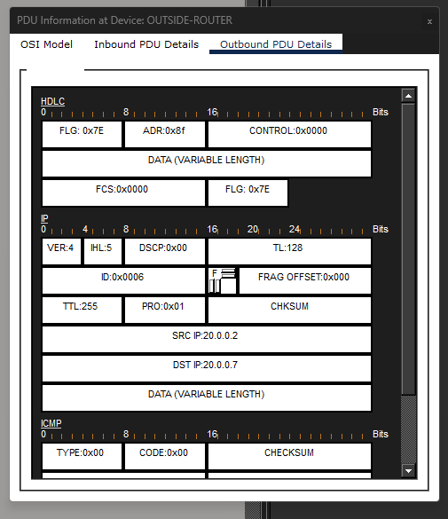
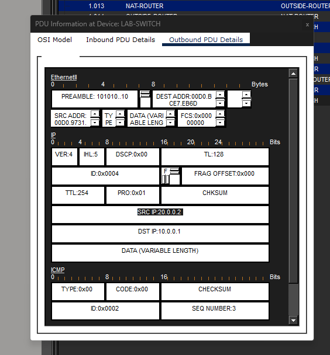
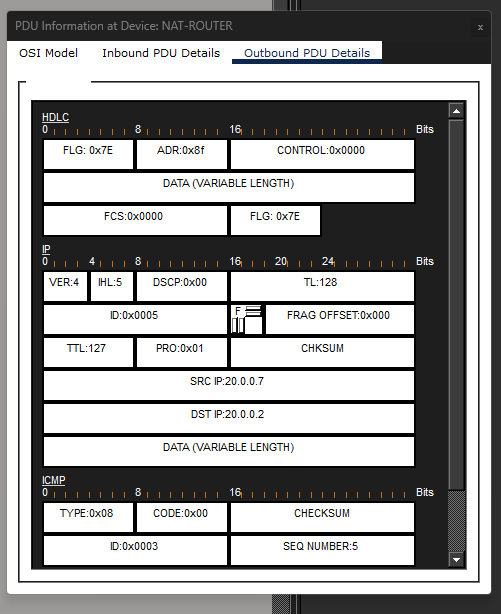

#Static NAT Configuration and Analysis (Cisco Packet Tracer)

## What I Did
Configured static Network Address Translation (NAT) on a router in Cisco Packet Tracer to translate a private internal IP address to a public-facing address, then traced ICMP traffic through the router to confirm the translation was working correctly at each hop.

## Tools Used
- Cisco Packet Tracer (router/switch configuration, PDU inspection)
- Cisco IOS CLI (`show ip int brief`, `show ip nat translations`)

## How I Did It
1. Set up a small topology with an internal LAN, a NAT-enabled router, and an outside network.
2. Configured static NAT to map an inside private address (`10.0.0.1`) to a public address (`20.0.0.7`).
3. Sent ICMP (ping) traffic from the inside host to an outside device and used Packet Tracer's PDU inspection tool to view the packet headers at each device along the path (source/destination IPs at the switch, the NAT router, and the outside router).
4. Confirmed the translation using `show ip nat translations` on the router.

## What I Found
| Term | Value | Meaning |
|---|---|---|
| Inside Local | 10.0.0.1 | The device's actual private IP |
| Inside Global | 20.0.0.7 | The public IP NAT translates it to |
| Outside Local | 20.0.0.2 | How the outside device appears from inside the network |
| Outside Global | 20.0.0.2 | The outside device's real public IP |

Tracing a single ping end-to-end showed the source address rewritten from `10.0.0.1` to `20.0.0.7` as it left the NAT router, and rewritten back to `10.0.0.1` on the return trip before being delivered to the originating host. A second host without a static mapping (`10.0.0.2`) passed through unmodified, confirming that only explicitly mapped addresses get translated.

### Router Interface Status
```
NAT-ROUTER#show ip int brief
Interface              IP-Address    OK?  Method  Status                Protocol
FastEthernet0/0        10.0.0.10     YES  manual  up                    up
FastEthernet0/1        unassigned    YES  unset   administratively down down
Serial0/0/0            20.0.0.1      YES  manual  up                    up
Serial0/0/1            unassigned    YES  unset   administratively down down
Vlan1                  unassigned    YES  unset   administratively down down
```

### NAT Translation Table
```
NAT-ROUTER#show ip nat translations
Pro  Inside global   Inside local   Outside local   Outside global
icmp 20.0.0.7:1       10.0.0.1:1     20.0.0.2:1      20.0.0.2:1
icmp 20.0.0.7:2       10.0.0.1:2     20.0.0.2:2      20.0.0.2:2
icmp 20.0.0.7:3       10.0.0.1:3     20.0.0.2:3      20.0.0.2:3
---  20.0.0.7         10.0.0.1       ---             —
```

### Packet Headers at Each Hop




## Key Takeaway
Watching the same packet's header change at each hop made NAT's "translation table" concept concrete — it's not just a rule on paper, it's a live lookup the router performs on every packet crossing the inside/outside boundary.
